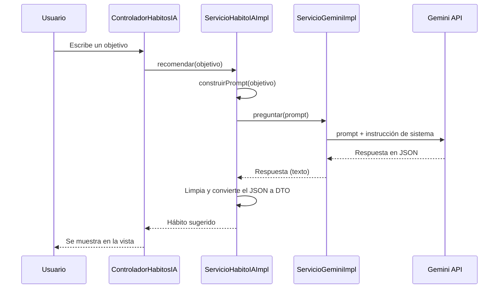

# App de Hábitos

Plataforma web gamificada para construir hábitos. El usuario cumple sus hábitos, demuestra que los cumplió con una evidencia, gana monedas y experiencia, sube de nivel y desbloquea recompensas canjeables en la vida real.

Proyecto académico desarrollado por un equipo de 6 personas con metodología Scrum en la materia Taller Web I (Universidad Nacional de La Matanza).

<!--
CAPTURAS: guardá las imágenes en docs/img/ y descomentá este bloque.

## Capturas

| Homepage | Crear hábito |
| --- | --- |
|  |  |

| Tienda | Perfil |
| --- | --- |
|  |  |
-->

## Funcionalidades

Después de registrarse o iniciar sesión, el usuario accede a una homepage con una barra de navegación hacia cinco secciones.

| Sección | Qué hace |
| --- | --- |
| **Hábitos** | Crear, seguir y completar hábitos. Incluye un asistente de IA que sugiere hábitos a partir de un objetivo. |
| **Tienda** | Compra de consumibles (boosts) con las monedas ganadas. Los boosts aceleran la obtención de experiencia. |
| **Recompensas** | Sistema tipo pase de batalla. Al subir de nivel se desbloquean beneficios (descuentos en gimnasios, barberías, tiendas y marcas) que el usuario canjea. Son simbólicos por tratarse de un proyecto académico, pero el flujo está pensado para funcionar así. |
| **Comunidad** | Espacio para que los usuarios se comuniquen, consulten cómo resolver hábitos o cómo desbloquear recompensas. |
| **Perfil** | Información personal, baúl de recompensas para canjearlas, monedero con el saldo disponible y logros desbloqueados. |

### Creación de hábitos

Al crear un hábito se cargan nombre, descripción, categoría, frecuencia y **tipo**. El tipo es clave: determina qué evidencia debe presentar el usuario para completarlo.

### Verificación con evidencia (anti-trampa)

Un hábito no se marca como cumplido con un simple clic: el usuario debe aportar una evidencia que el backend valida.

| Tipo de evidencia | Ejemplo | Cómo se valida |
| --- | --- | --- |
| **Horario límite** | "Me voy a acostar antes de las 23" | El usuario fija las 23:00 como límite al crear el hábito. Al completarlo, un modal le pide el horario real. El backend primero comprueba que ese horario sea coherente con la hora actual (para evitar que se cargue uno falso) y después lo compara con el límite. |
| **Imagen** | Foto de que realizó la actividad del día | El usuario sube una imagen y el servicio de IA verifica que coincida con el hábito. |

Al cumplir satisfactoriamente un hábito, el usuario obtiene monedas y experiencia.

## Asistente de IA

En la sección Hábitos, el usuario escribe un objetivo general (por ejemplo, "quiero dormir mejor") y la IA lo transforma en un hábito concreto, medible y con frecuencia, con nombre, descripción, frecuencia y categoría.

El flujo está separado en capas para que cada clase tenga una única responsabilidad y se puedan sumar otros proveedores de IA sin tocar el resto de la aplicación.



| Clase / interfaz | Responsabilidad |
| --- | --- |
| `ControladorHabitosIA` | Recibe la petición del usuario y delega en el servicio. |
| `ServicioHabitoIA` / `ServicioHabitoIAImpl` | Lógica del caso de uso: construye el prompt, pide la respuesta y la convierte a un DTO (`recomendar`, `sugerirPlan`). |
| `ServicioIA` / `ServicioGeminiImpl` | Abstracción del proveedor de IA (`preguntar`) y su implementación con Gemini. Para usar otro modelo alcanza con crear otra implementación. |
| `PlanHabitoDTO` | Estructura con la que se transporta el hábito sugerido hacia la vista. |

**Instrucción de sistema:** se le indica a la IA que actúe como experta en creación de hábitos, que el hábito sea medible, simple y con frecuencia, y que responda únicamente con un JSON (`nombre`, `descripcion`, `frecuencia`, `categoria`). La respuesta se limpia (por ejemplo, se quitan los bloques de markdown que a veces agrega el modelo) y se deserializa con Jackson.

## Arquitectura

Aplicación web monolítica con arquitectura **MVC en capas**:

```
Vista (Thymeleaf) → Controlador → Servicio → Repositorio (Hibernate) → MySQL
```

El diseño se basó en los principios **SOLID**: clases con una responsabilidad específica, servicios definidos como interfaces con sus implementaciones y dependencias hacia abstracciones (como en el módulo de IA).

## Tecnologías

| Área | Tecnologías |
| --- | --- |
| Backend | Java 11, Spring MVC 5.2, Hibernate 5.4, Jetty embebido |
| Frontend | Thymeleaf, HTML, CSS, JavaScript, Bootstrap 5 |
| Base de datos | MySQL |
| IA | Google Gemini |
| Testing | JUnit 5, Mockito, Hamcrest, Playwright (E2E), pruebas unitarias de JavaScript |
| Calidad de código | JaCoCo, PMD y CPD, Checkstyle, Prettier, ESLint |
| Infraestructura | Maven, Docker y Docker Compose, GitHub Actions |

## Cómo ejecutarlo

### Requisitos

- JDK 11
- Maven 3.8 o superior
- Docker
- Node 18 o superior (solo para las pruebas de JavaScript y ESLint)

### Configuración

1. Clonar el repositorio:

   ```
   git clone https://github.com/tomasDiuorno/app-de-habitos.git
   cd app-de-habitos
   ```

2. Crear un archivo `.env` en la raíz con las variables de la base de datos y la API key de Gemini.

   ```
   # TODO: completar con los nombres reales de las variables
   ```

3. Levantar la base de datos MySQL con Docker:

   ```
   docker build -f DockerfileSQL -t mysql .
   docker run --env-file .env --name mysql-container -d -p 3306:3306 mysql
   ```

4. Iniciar la aplicación:

   ```
   mvn clean jetty:run
   ```

5. Abrir <http://localhost:8080/spring>.

### Alternativa con Docker Compose

```
mvn clean package
docker-compose up --build
```

## Tests

```
# Pruebas unitarias (JUnit, Mockito, Hamcrest) + reporte de cobertura
mvn clean test

# Pruebas end-to-end con Playwright (con el servidor corriendo en otra terminal)
mvn test -Dtest="VistaLoginE2E"

# Pruebas unitarias de JavaScript
cd src/main/webapp/resources/core/js
npm install
npm run test
```

## Calidad de código

El pipeline de integración continua (GitHub Actions) y el ciclo de vida de Maven ejecutan estas herramientas automáticamente:

| Herramienta | Función |
| --- | --- |
| **Prettier** | Formateo automático del código Java. |
| **Checkstyle** | Convenciones de nombres, Javadocs e importaciones (basado en Google Style). |
| **PMD** | Errores potenciales, variables sin usar y malas prácticas. |
| **CPD** | Detección de código duplicado. |
| **JaCoCo** | Cobertura de tests, con un mínimo de 80%. |
| **ESLint** | Análisis del código JavaScript. |

Los reportes se generan en `.calidad-de-codigo/`.

<details>
<summary>Comandos útiles de calidad</summary>

```
mvn pmd:check              # valida reglas de PMD
mvn pmd:cpd-check          # valida código duplicado
mvn checkstyle:check       # valida convenciones
mvn prettier:write         # formatea el código
mvn jacoco:report          # genera el reporte de cobertura
```

</details>

<details>
<summary>Despliegue con Docker (WAR en Jetty o Tomcat)</summary>

```
mvn clean package
docker build -f DockerfileJetty -t tallerwebi .
docker run -p 8080:8080 tallerwebi
```

Los Dockerfiles esperan que el WAR se llame `tallerwebi-base-1.0-SNAPSHOT` (configurable en el `pom.xml`).

</details>

## Estado del proyecto

El proyecto se encuentra completo en aproximadamente un 80%. Los módulos principales están implementados. Lo que resta:

- Pulir algunas relaciones entre entidades.
- Unificar los estilos del frontend.
- Resolver conflictos puntuales en ciertos servicios.

## Equipo

Equipo de 6 personas, trabajando con Scrum.

| Integrante | Rol y aportes |
| --- | --- |
| **Tomás Diuorno** | Líder del equipo y documentación. Armó la base del proyecto y desarrolló los módulos de registro, hábitos y recompensas, además de la integración con IA. |
| [Nombre] | [Módulos o aportes] |
| [Nombre] | [Módulos o aportes] |
| [Nombre] | [Módulos o aportes] |
| [Nombre] | [Módulos o aportes] |
| [Nombre] | [Módulos o aportes] |

## Créditos

Basado en el proyecto base de la materia Taller Web I (UNLaM), que a su vez parte del ejemplo [Spring MVC hello world (Maven and Thymeleaf)](https://mkyong.com/spring-mvc/spring-mvc-hello-world-example/).
